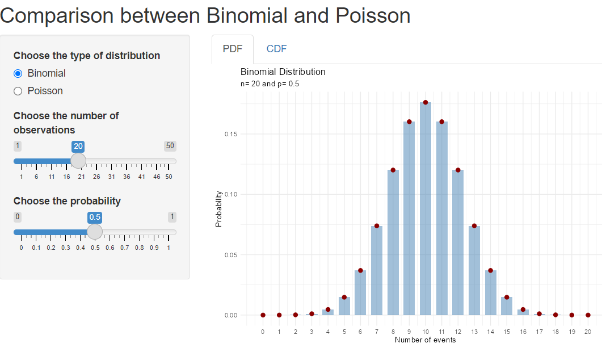
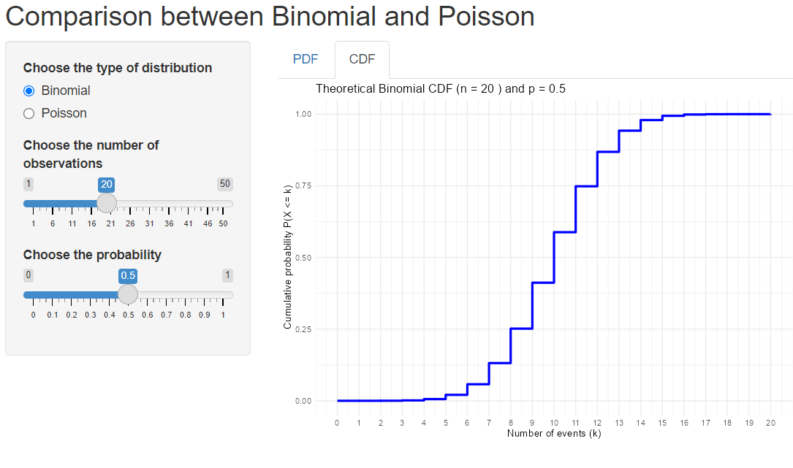

# Binomial-Poisson Explorer

An interactive **Shiny** and **Quarto Dashboard** application for exploring two fundamental discrete probability distributions:

- **Binomial Distribution**
- **Poisson Distribution**

The application provides visualizations of both the **Probability Mass Function (PMF/PDF)** and the **Cumulative Distribution Function (CDF)**, allowing users to understand how distribution parameters affect probabilities and distribution shapes.

---

## Screenshots

### Binomial Distribution – PMF



### Binomial Distribution – CDF



### Poisson Distribution – PMF


### Poisson Distribution – CDF


---

## Features

### Distribution Selection

Choose between:

- Binomial Distribution
- Poisson Distribution

### Binomial Parameters

Adjust:

- Number of trials (`n`)
- Probability of success (`p`)

The application automatically updates:

- Probability Mass Function (PMF)
- Cumulative Distribution Function (CDF)

### Poisson Parameters

Adjust:

- Rate parameter (`λ`)

The application automatically updates:

- Probability Mass Function (PMF)
- Cumulative Distribution Function (CDF)

### Interactive Visualizations

#### PMF (Probability Mass Function)

Displays:

\[
P(X = k)
\]

for each possible number of events.

The PMF is visualized using:

- Bars representing probabilities
- Points highlighting exact probability values

#### CDF (Cumulative Distribution Function)

Displays:

\[
P(X \leq k)
\]

for each possible number of events.

The CDF is visualized as a step function, reflecting the discrete nature of the distributions.

---

## Statistical Background

### Binomial Distribution

The Binomial distribution models the number of successes in a fixed number of independent trials.

\[
X \sim Bin(n,p)
\]

where:

- \(n\) = number of trials
- \(p\) = probability of success

Probability Mass Function:

\[
P(X=k)=\binom{n}{k}p^k(1-p)^{n-k}
\]

Mean:

\[
E(X)=np
\]

Variance:

\[
Var(X)=np(1-p)
\]

---

### Poisson Distribution

The Poisson distribution models the number of events occurring within a fixed interval when events occur independently at a constant average rate.

\[
X \sim Pois(\lambda)
\]

where:

- \(\lambda\) = average rate of occurrence

Probability Mass Function:

\[
P(X=k)=\frac{\lambda^k e^{-\lambda}}{k!}
\]

Mean:

\[
E(X)=\lambda
\]

Variance:

\[
Var(X)=\lambda
\]

---

## Installation

### Required Packages

```r
install.packages(c(
  "shiny",
  "ggplot2"
))
```

For the Quarto dashboard:

```r
install.packages("quarto")
```

---

## Running the Shiny App

Open `App.R` in RStudio and run:

```r
shiny::runApp()
```

or click **Run App**.

---

## Running the Quarto Dashboard

Open `Dashboard.qmd` and render:

```r
quarto::quarto_render("Dashboard.qmd")
```

or click **Render** in RStudio.

---

## Project Structure

```text
Binomial-Poisson-Explorer/
│
├── App.R
├── Dashboard.qmd
├── README.md
│
└── screenshots/
    ├── binomial-pdf.png
    ├── binomial-cdf.png
    ├── poisson-pdf.png
    └── poisson-cdf.png
```

---

## Educational Uses

This application is useful for:

- Introductory Probability courses
- Statistics courses
- Teaching discrete probability distributions
- Understanding PMFs and CDFs
- Comparing Binomial and Poisson models
- Demonstrating how parameters affect distribution shape
- Exploring the Poisson approximation to the Binomial distribution

---

## Technologies Used

- R
- Shiny
- Quarto Dashboard
- ggplot2

---

## Author

Developed as an interactive educational tool for exploring discrete probability distributions and their cumulative probabilities.
